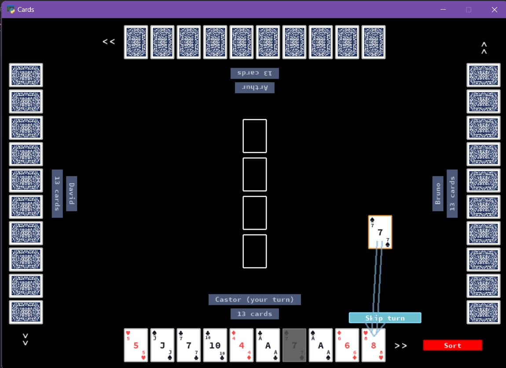

# cards

This project contains a playable `pyglet` app for the Swedish card game Sjuan. The rules are basically as described [here](https://kortspel24.se/sjuan/) (you may have to translate the webpage into English).

The project makes use of Python type hints and a functional style, utilising the [`algebraic-data-types` package](https://github.com/jspahrsummers/adt).

The app automatically handles player turns to make it playable locally (hides everyone's cards except the current player), and contains custom UI and animations. The implementation of the ruleset is also very modular and extensible, so it would be easy to change how e.g. move legality, turn-skipping, and drawing from the pile are handled.

There is also some not-fully-implemented code to train AI to play the card game with the help of `pytorch`, but this can't/shouldn't be used.

## how to play

Install the dependencies in `requirements.txt` and then play the game by running `python main.py`, optionally passing in either a number of players (e.g. `python main.py 4` for four players) or a list of player names (e.g. `python main.py Anna Boris Cillian`).